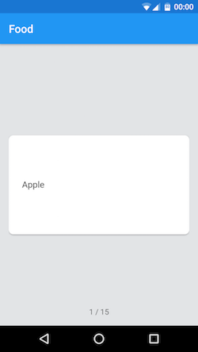

Flashcards for Trello
====================

Flashcards for Trello allows you to use the power of Trello boards to manage your flashcards.
Whether you're learning a new language, memorising formulas, or studying for an exam – Flashcards
for Trello has got you covered!

Use Trello to create and edit your flashcards. Flashcards for Trello will then use your personal
lists to create a powerful learning experience. The title of a card is used as the question, it's
description as the answer. Flashcard for Trello also support images and (optionally) MathML for
mathematic formulas!

Flashcards for Trello also moves cards to new lists if you have answered them correctly. This allows
the usage of a sophisticated memorising system like spaced repetition or the
[Leitner system](https://en.wikipedia.org/wiki/Leitner_system).

Screenshots
------------

 
 

 
 

Features
--------

* Use Trello to manage your flashcards
* Free open source Android app
* Format your cards using [Markdown](https://en.wikipedia.org/wiki/Markdown) (like in Trello)
* Select the number of cards for one session
* In-order, reverse, or random selection of cards
* Images supported
* MathML support through [MathJax](https://www.mathjax.org/)
* Move correctly/wrongly answered cards to different lists
* Hide irrelevant boards

Open source licenses
-------------------

Flashcards for Trello uses the following open source libraries:

* Various [Android Support Libraries](http://developer.android.com/tools/support-library/index.html)
* [Volley](http://developer.android.com/training/volley/index.html)
* [MarkdownView](https://github.com/falnatsheh/MarkdownView) ([License](https://raw.githubusercontent.com/falnatsheh/MarkdownView/master/license.txt))
* [MathJax](https://www.mathjax.org/)([License](https://raw.githubusercontent.com/mathjax/MathJax/master/LICENSE))
* [Material Ripple Layout](https://github.com/balysv/material-ripple) ([License](https://raw.githubusercontent.com/balysv/material-ripple/master/LICENSE))
* [DrawShadowFrameLayout](https://github.com/google/iosched/blob/master/android/src/main/java/com/google/samples/apps/iosched/ui/widget/DrawShadowFrameLayout.java) from the Google I/O App  ([License](https://raw.githubusercontent.com/google/iosched/master/LICENSE.txt))